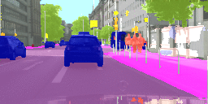
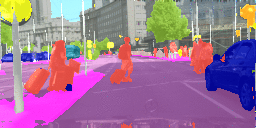
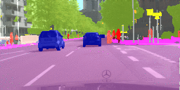

# NextSegmPredICCV17
This repository contains an implementation of the following paper:

Pauline Luc*, Natalia Neverova*, Camille Couprie, Jakob Verbeek, Yann LeCun, [Predicting Deeper into the Future of Semantic Segmentation](https://arxiv.org/abs/1703.07684). ICCV, 2017.

It reproduces the results obtained with the S2S (segmentation to segmentation) model described in the paper (shown below). Frames with no border correspond to the input while red borders indicate predicted frames.

 
 
<br />

To run the code, you will need to install lua torch and the following torch packages: cutorch, cunn, cudnn, nnx, nngraph, paths, display, torchnet. 

### Training/validation data
[Download data](https://s3.amazonaws.com/nextsegmpred/Data2.zip) and save in the "Data" directory. It contains soft segmentations produced by the Dilation10 network applied to the Cityscapes dataset and has two subdirectories:
- **train** contains 99 sample training batches of 4 sequences x 5 frames (4 inputs + 1 target) x 64 x 64. Please note that this is only a small part of the whole training set, provided for the reference, and it is not sufficient for training the network from scratch;
- **val** contains 500 test sequences from Cityscapes: 125 batches of 4 sequences x 7 frames (4 inputs + 3 targets) x 256 x 128 (contains both RGB images and their segmentations).

### Pretrained models
We provide two pretrained models described in the paper: model S2S, AR (trained_models/S2S_AR_cpu.t7) and model S2S-dil, AR, fine-tune (trained_models/S2S_dil_AR_ft_cpu.t7) giving the following results on the cityscapes validation dataset (set nRecFrames to 0 for short term and to 2 for midterm predictions):

| Method                         | Short term IoU SEG | Mid term IoU SEG |
| ------                         | ------------------ |  -------------   |
| Model S2S, AR                  |       63.53        | 47.23            |
| Model S2S-dil, AR, fine-tune   |       65.30        | 50.42            |


### Train/Test scripts

- **train.lua** - training script allowing to train the "S2S, AR" from scratch on a provided subset of training batches;
- **test.lua** - test script reproducing model performance on the validation set.
The same script with the "--save" option allows to dump obtained results on the disk and create gif animations.

### Bibtex

If you find this code useful in your research then please cite:

```
@article{NextSegmPredICCV17,
  title={Predicting Deeper into the Future of Semantic Segmentation},
  author={Luc, Pauline and Neverova, Natalia and Couprie, Camille and Verbeek, Jacob and LeCun, Yann},
  journal={ICCV},
  year={2017}
}
```

### Contact
For all questions and comments, please contact us at [paulineluc, nneverova or coupriec]@fb.com.
